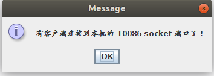
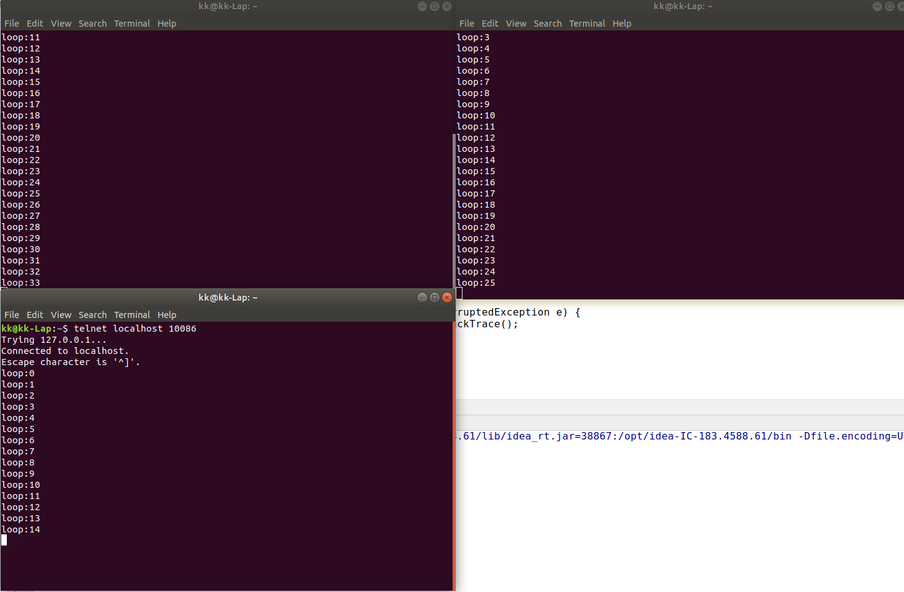
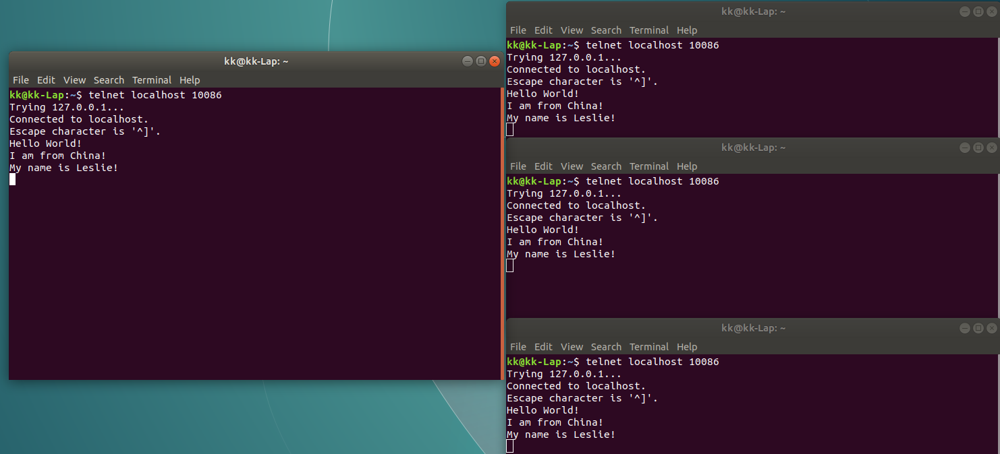

### Socket 服务端


#### ServerSocket 的建立与使用

**用 IDEA 创建一个 Java 项目作为演示：**

1. 创建一个类：MyServerSocket
2.  生成 main 方法
3.  在 main 方法里面写具体代码

```java
public class MyServerSocket {

    public static void main(String[] args) {


        int port = 10086;
        try {
            ServerSocket serverSocket = new ServerSocket(port);

            //这里会阻塞
            Socket socket = serverSocket.accept();
            //建立连接了。可以用浏览器访问：127.0.0.1:10086 测试。
            JOptionPane.showMessageDialog(null,"有客户端连接到本机的 10086 socket 端口了！");
        } catch (IOException e) {
            e.printStackTrace();
        }
    }
}
```

4. 把这个类运行起来
5. 打开浏览器，输入：127.0.0.1:10086 回车。

**结果：**



---


#### 使用 ServerSocket 建立聊天服务器

上面的使用方法仅仅是为了演示效果，实际上不能这么写，因为 accept 方法会造成组成，在主线程不能这样！

于是新建一个类，监听客户端连接，只要连接到就创建一个会话线程。

**1. 创建 ServerListener** 作为一个监听线程：

```java
public class ServerListener extends Thread {

    @Override
    public void run() {

        int port = 10086;
        try {
            ServerSocket serverSocket = new ServerSocket(port);

            //一旦有客户端连接到服务端，这个方法就会返回一个新的 socket 实例。

            while (true) {
                Socket socket = serverSocket.accept();
                //建立连接了。可以用浏览器访问：127.0.0.1:10086 测试。
                JOptionPane.showMessageDialog(null, "有客户端连接到本机的 10086 socket 端口了！");

                //客户端链接后就要开一个新的线程
                new ChatSocket(socket).start();
            }


        } catch (IOException e) {
            e.printStackTrace();
        }
    }
}
```

**2. 创建 ChatSocket ** 作为具体与客户端聊天线程：

```java
public class ChatSocket extends Thread {

    private Socket socket;

    public ChatSocket(Socket socket) {
        this.socket = socket;
    }

    private void printOut(String outStr) {
        try {
            socket.getOutputStream().write(outStr.getBytes("UTF-8"));
        } catch (IOException e) {
            e.printStackTrace();
        }
    }

    @Override
    public void run() {

        //获取 socket 输出流
        try {

            //todo 模拟往客户端写数据
            int count = 0;
            while (true) {
                printOut("loop:" + count++ + "\n");
                Thread.sleep(1000);
            }
        } catch (InterruptedException e) {
            e.printStackTrace();
        }
    }
```

**3. 试试效果！**

1. 运行 MyServerSocket 类
2. 打开命令行终端(我用的是 Ubuntu)
3. 执行命令：telnet localhost 10086
4. 为了看效果，再多开几个命令行终端，执行 3 命令。

**4. 结果：**

每运行一个命令行终端，就会弹出一个消息提示框：


然后命令行终端就会一直收到服务端发的信息：



---

---

**但是，当有多个终端连接到服务器时，仅仅是逐个开启了 ChatSocket 会话，这些会话之间没有通信功能！所以需要把这些会话管理起来！**

**5. 创建管理类：ChatManager**

```java
public class ChatManager {

    private static final ChatManager chatManager = new ChatManager();
    private  Vector<ChatSocket> vector = new Vector<>();
    private ChatManager(){}

    public static ChatManager getChatManager(){
        return chatManager;
    }


    public void add(ChatSocket chatSocket){
        vector.add(chatSocket);
    }


    public void publishMsg(ChatSocket chatSocket,String msg){
        for (int i = 0; i < vector.size(); i++) {

            //判断如果给某一个会话发了消息了，那么就不要重复发送
            ChatSocket itemChatSocket = vector.get(i);
            if (!chatSocket.equals(itemChatSocket)) {
                //这个会发给所有的客户端
                itemChatSocket.printOut(msg);
                System.out.println("已经发过了");
            }else {
                System.out.println("发给别别人");

            }
        }
    }
}
```

**6. 监听类 ServerListener 稍作修改：**

```java
public class ServerListener extends Thread {

    @Override
    public void run() {

        int port = 10086;
        try {
            ServerSocket serverSocket = new ServerSocket(port);
            ChatManager chatManager = ChatManager.getChatManager();
            //一旦有客户端连接到服务端，这个方法就会返回一个新的 socket 实例。

            while (true) {
                Socket socket = serverSocket.accept();
                //建立连接了。可以用浏览器访问：127.0.0.1:10086 测试。
                JOptionPane.showMessageDialog(null, "有客户端连接到本机的 10086 socket 端口了！");

                //客户端链接后就要开一个新的线程
                ChatSocket chatSocket = new ChatSocket(socket);
                chatSocket.start();
                chatManager.add(chatSocket);
            }


        } catch (IOException e) {
            e.printStackTrace();
        }
    }
}

```

**7.  会话线程 ChatSocket **去掉模拟发送给客户端数据，用输入流获取本客户端输出内容，然后通过管理类 **ChatManager** 发给其他的客户端:

```java
public class ChatSocket extends Thread {

    private Socket socket;

    public ChatSocket(Socket socket) {
        this.socket = socket;

    }

    public void printOut(String outStr) {
        try {
            socket.getOutputStream().write((outStr+"\n").getBytes("UTF-8"));
        } catch (IOException e) {
            e.printStackTrace();
        }
    }

    @Override
    public void run() {

        //获取 socket 输出流
        try {

            //接收数据
            BufferedReader br = new BufferedReader(
                    new InputStreamReader(
                            socket.getInputStream(), "UTF-8"));

            String line = null;
            while ((line = br.readLine()) != null) {
                ChatManager.getChatManager().publishMsg(this, line);
            }
            br.close();

            //todo 模拟往客户端写数据
            /*int count = 0;
            while (true) {
                printOut("loop:" + count++ + "\n");
                Thread.sleep(1000);
            }*/
        }  catch (IOException e) {
            e.printStackTrace();
        }
    }
}

```


**8. 结果：**

